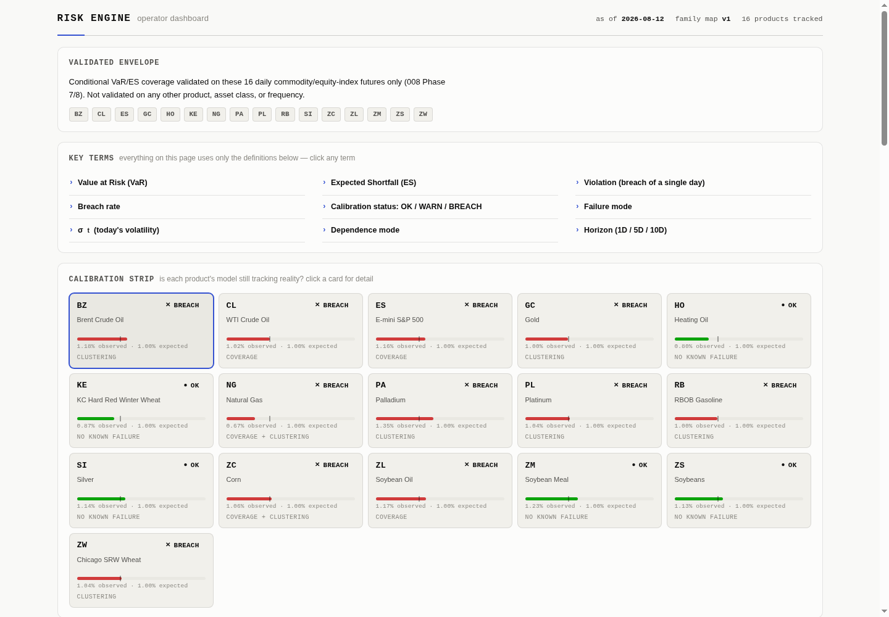

# quant-trading-labs

This repository is a collection of quantitative trading research: a sequence of notebooks
testing ideas against real market data, with pre-registered gates, walk-forward or holdout
validation, and honest reporting of what didn't work. Most of it didn't.

The exception is tail-risk calibration. Notebook 005 found that GARCH-t and EVT models
correctly calibrate BTC's conditional tail risk. Notebook 006 confirmed the finding held
across more crypto symbols and intervals. Notebook 008 then found the same calibration held
for commodity and equity-index futures, and the result reproduced on a separate holdout
period. That's the one finding in this programme solid enough to build on, so I turned it into
production software.

`src/risk/` is that build: a risk engine covering 16 daily commodity and equity-index futures.
For each product it fits a calibrated return distribution, computes Value-at-Risk and Expected
Shortfall at multiple horizons, and continuously monitors whether that calibration is still
holding as new data comes in. It ships with a data-cleaning contract, a versioned model
selection per product, a calibration monitor, a refresh pipeline, and the dashboard below.

**[Live dashboard →](https://quant-trading-labs.vercel.app/)**

Read [docs/10-risk-engine.md](docs/10-risk-engine.md) for the full write-up: how the data is
cleaned, how the model per product was chosen, how the monitor works, and what the engine has
and hasn't been validated for.

The dashboard is static HTML, CSS, and vanilla JavaScript, with no server. Regenerate it with
`uv run python src/research/tmp/render_risk_dashboard.py` (writes `index.html` at the repo root
from the current `src/risk/data/` ingest; run `risk.ingest.refresh()` first if that's stale).

## Results

- [001 — Simple Linear](src/results/001_simple_linear.md) — Tested whether a simple linear model trading BTC's return sign was profitable, after fixing three fee/backtest bugs; results untrustworthy (overfitting/constant bets).
- [002 — Walk-Forward Multi-Asset](src/results/002_walk_forward_multi_asset.md) — Rigorously walk-forward validated the linear approach across 5 years and 6 symbols with proper baselines and deflated Sharpe; found no validated edge.
- [003 — Cross-Sectional IC](src/results/003_cross_sectional_ic.md) — Built a 30-symbol cross-sectional IC-screening pipeline with real transaction costs; signal was gross-profitable but costs and a holdout run erased any edge.
- [004 — Distributional Models](src/results/004_distributional_models.md) — Tested whether distributional models could forecast BTC volatility or identify informative regimes instead of predicting direction; found no point-forecast winner and regimes predict risk, not return.
- [005 — Tail Risk (EVT)](src/results/005_tail_risk_evt.md) — Tested which distributional models best calibrate BTC's conditional tail risk (GARCH-t, GJR-GARCH, EVT); found statistically certified tail-calibration winners but no application cleared the bar for trading.
- [006 — Distribution Zoo](src/results/006_distribution_zoo.md) — Tests whether notebook 5's BTC-only tail-risk findings generalize across more crypto symbols, intervals, and distribution families.
- [007 — Alpha Generation](src/results/007_alpha_generation.md) — Tests whether cutting transaction costs on a known-profitable crypto signal, plus carry and tail-factor signals, can produce tradeable alpha.
- [008 — Commodity Tails and Risk](src/results/008_commodity_tails_and_risk.md) — Tests whether crypto's fat-tail and risk-calibration findings, plus carry/momentum strategies, replicate in commodity futures.
- [009 — External Research Review](src/results/009_external_research_review.md) — Surveys external research literature to diagnose why eight notebooks found no tradeable crypto/commodity alpha.
- [010a — Term Structure Regimes and Spreads](src/results/010a_term_structure_regimes_and_spreads.md) — Builds a term-structure regime atlas and spread taxonomy to pre-register a future commodity spread mean-reversion backtest.
- [010b — Spread Strategies](src/results/010b_spread_strategies.md) — Tested five commodity spread-trading gates (mean-reversion, regime-gating, vol-scaled carry, blended momentum) for cost-surviving alpha; all five came back null.
- [011a — Methodology Transfer and Reproduction](src/results/011a_methodology_transfer_and_reproduction.md) — Reproduced and validated an external spread-trading programme's half-life and control-book results on this repo's own data before pre-registering gates for follow-on notebooks.
- [011b — Spread Mechanism Gates](src/results/011b_spread_mechanism_gates.md) — Tested whether an external programme's discrete-trade spread mechanisms (stops, sign-flips, screens, reentry sweeps) beat this repo's simple continuous benchmark; none did.
- [011c — Entry-Time Loss Classifier](src/results/011c_entry_time_loss_classifier.md) — Tested a walk-forward classifier predicting which spread trades would stop out from entry-time features; it did not reliably beat chance or improve the trading book.
- [011d — Momentum Breakout Transfer](src/results/011d_momentum_breakout_transfer.md) — Tested a transferred breakout trading rule on crypto perpetuals and commodity-equities; crypto was inconclusive due to small sample, equities failed outright.
- [012 — Volume-Confirmed Breakout](src/results/012_volume_confirmed_breakout.md) — Tested whether gating a symmetric bull-flag breakout with a volume-confirmation filter improves an 88-instrument, three-asset-class pooled backtest; the filter failed to pay for itself.
- [013 — Four Outside Designs, Rebuilt and Scored](src/results/013_four_outside_designs_rebuilt_and_scored.md) — Rebuilt four externally-published trading strategies faithfully on this repo's own data and costs to see if any reproduce; none did.
- [014 — Market Regime Engine and Accuracy](src/results/014_market_regime_engine_and_accuracy.md) — Ported the live production market-regime engine and scored its historical label accuracy against two independent ground-truth sources; the port was faithful but accuracy and crisis-lag checks failed.
- [015 — Trend Ceiling and Independent Validation](src/results/015_trend_ceiling_and_independent_validation.md) — Re-tested 014's two ambiguous regime dimensions against fully independent targets and ran a ceiling test on directional trend predictability; both came back as settled nulls with a quantified detection bound.
- [016 — Polynomial Power Features](src/results/016_polynomial_power_features.md) — Swapped notebook 1's single linear feature for 3-feature polynomial power combinations of the same lag, walk-forward validated; no combo found a real edge, and turnover (not signal quality) drove which config lost the least.
